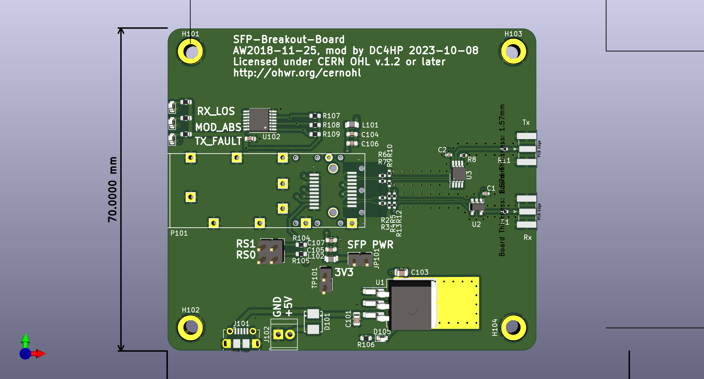
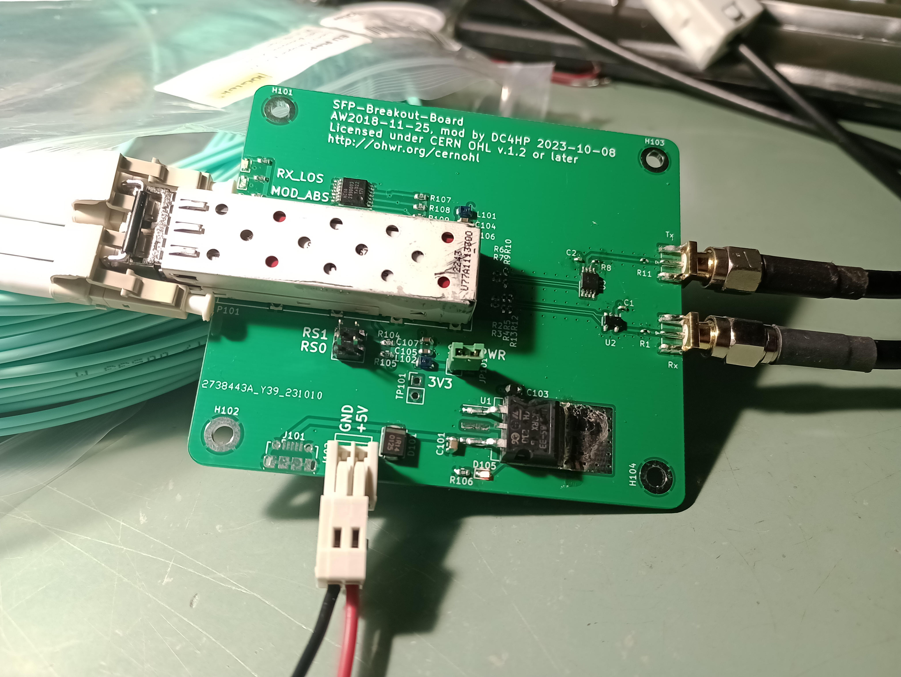

# Modified SFP-Breakout-Board

This is a modified version of Anders Wallins SFP Breakout Board https://github.com/aewallin/SFP-Breakout-Board

Like the original this works as a SFP fibre-optical transciever simple breakout board up to at least 1 Gbit/s.

What's changed is that is has
* single-ended TX and RX outputs/inputs with SMA connectors (similar to Anders' SFP2SMA_2018.03 board, but with LVDS/LVPECL converters instead of baluns and op amps)
* different (cheaper) LDO

What's unchanged is
* connector and cage for SFP or SFP+ transciever
* +3V3 power for transciever
* Three status LEDs for TX_FAULT, LOS, and MOD_ABS
* jumpers for SFP rate-select settings.

See also these other similar projects:

* https://github.com/aewallin/SFP2SMA_2018.03  single-ended input/output, with op-amp and transformer coupling to SFP
* https://osmocom.org/projects/misc-hardware/wiki/Sfp-experimenter
* https://osmocom.org/projects/misc-hardware/wiki/Sfp-breakout
* Multi-SFP crate https://www.ohwr.org/project/sfp-plus-i2c/wikis/home
